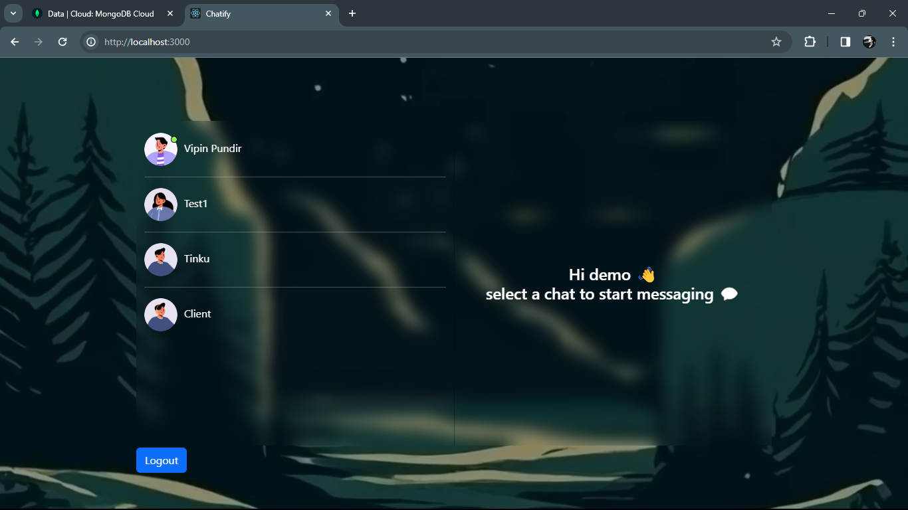
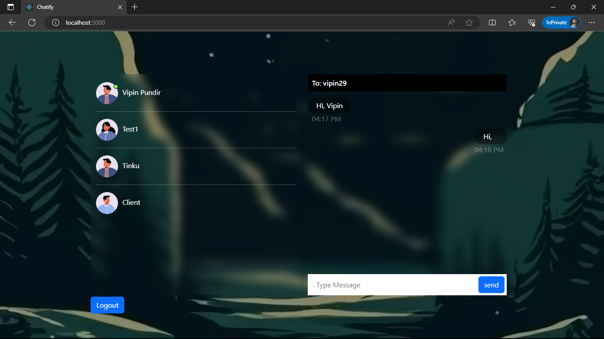

# Chat Application using MERN Stack

A simple chat application developed using the MERN (MongoDB, Express.js, React, Node.js) stack. Users can register, log in, and exchange messages with other registered users.



## Table of Contents
- [Features](#features)
- [Dependencies](#dependencies)
- [Installation](#installation)
- [Usage](#usage)

## Features
- User registration and login
- Real-time messaging with Socket.IO
- Secure authentication using JSON Web Tokens (JWT)
- Password hashing with bcryptjs
- CORS handling for cross-origin requests
- MongoDB for database storage

## Dependencies
- bcryptjs: ^2.4.3
- cookie-parser: ^1.4.6
- cors: ^2.8.5
- dotenv: ^16.4.4
- express: ^4.18.2
- jsonwebtoken: ^9.0.2
- mongoose: ^8.1.2
- socket.io: ^4.7.4

## Installation
1. Clone the repository
   ```bash
   git clone https://github.com/vipinpundir/chat-app.git

2. Install dependencies

    ```bash
    cd your-chat-app
    npm install

3. Set up environment variables

- Create a .env file in the root directory and add the necessary variables (e.g., MONGODB_URI, JWT_SECRET, etc.).

4. Run the application

    ```bash
    npm start or node index.js

## Usage
1. Register a new account or log in with existing credentials.
2. Start sending and receiving messages with other registered users.
3. Enjoy real-time chat functionality using Socket.IO.


